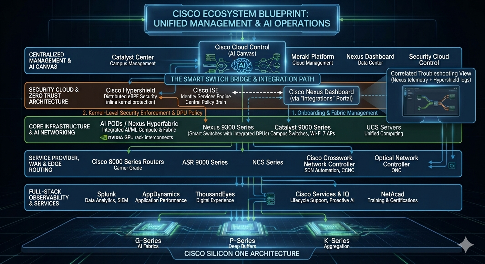
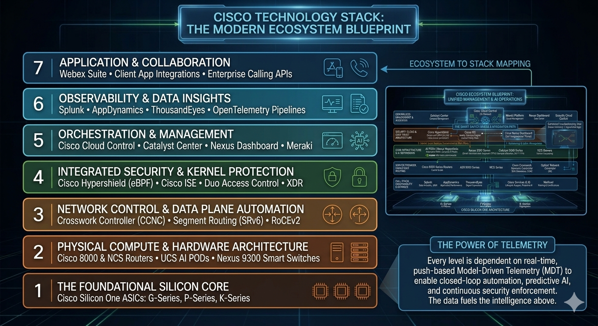

# Cisco IT Application Profile: Professional Portfolio
**Candidate:** Sadique Ali Khan  
**Role Target:** Systems & Network Infrastructure Architect  
**Location:** Bengaluru, Karnataka, India  

---

## 1. Professional Cover Letter

**Sadique Ali Khan**  
Bengaluru, Karnataka, India  
sadique.khan@example.com | +91-0000000000  

October 1, 2026  

**To the Architecture & Strategy Leadership Team,**  

Every enterprise technology ecosystem has plenty of pure technical experts who understand the nuances of a single software feature or an ASIC's pipeline. However, as infrastructure scales to meet modern workloads, the highest-risk points of failure rarely lie within the technology itself—they occur in the friction point where technology meets Day-1 and Day-2 operations. I have spent my career defining myself not as a siloed technology purist, but as **the best possible adhesive between technology and operations**. I translate high-level intent into predictable, automated operational outcomes for all stakeholders.

My path started on the front lines at Concentrix India, where I managed technical support logistics for Apple consumer products. This foundational role taught me to look at complex engineering systems through the lens of user impact, clarity, and rapid issue resolution. Transitioning to Synophic (now Prodapt) supporting the Cisco CMS portfolio, I mastered Day-2 operations, keeping complex data center fabrics stable for global enterprise clients. This deep operational expertise led to my full-time absorption into Cisco Systems India as a Technical Consulting Engineer, where I learned how to bridge the gap between engineering teams, the Business Unit (BU), and the Technical Assistance Center (TAC) to solve critical infrastructure crises under strict SLAs.

Today, within the Cisco IT Data Center Networking team, I am actively applying this practical experience to drive modernization across our infrastructure. I have successfully moved our lifecycle management processes away from fragmented silos and into unified, automated Terraform pipelines. Furthermore, I built an internal standalone lab from scratch containing a fully operational ACI fabric with downstream UCS compute elements—personally managing the racking, stacking, and patching infrastructure. By introducing configuration symmetry and precise upgrade group planning, I engineered an ACI fabric upgrade process that compressed execution windows from multiple days down to a few hours. To sustain this velocity, I built AI workflows that automate the heavy paperwork and documentation required for compliance and change approvals.

As I look to step into more architectural roles, I am seeking an organization that values this rigorous operational baseline and can offer **international immigration or visa application sponsorship support** to anchor my long-term career growth. I bring a unique perspective shaped by years of hands-on experience at the command-line interface. I understand how design decisions directly impact daily operations, licensing costs, and long-term maintenance. I look forward to helping design resilient, automated infrastructure fabrics that blend technical capabilities with streamlined operational workflows.

Sincerely,  
**Sadique Ali Khan**  

---

## 2. Professional Resume

### Professional Summary
Systems-focused Network Engineer with over 8 years of experience managing complex IT infrastructures, specializing in data center fabrics, network security, and infrastructure automation. Proven track record of bridging the gap between high-level architectural designs and practical Day-1/Day-2 operations. Adept at streamlining lifecycle management, accelerating incident resolution through model-driven telemetry, and collaborating across TAC and BU teams to deliver resilient, automated infrastructure upgrades.

### Core Technical & Operational Portfolio
* **Data Center & Fabric Orchestration:** Cisco Nexus Dashboard, Cisco ACI, NXOS, Application Centric Infrastructure.
* **Security & Identity Frameworks:** Cisco Firepower Threat Defense (FTD), Firepower Management Center (FMC), Cisco ISE.
* **Infrastructure Automation & DevOps:** Terraform, Python, GitHub, Infrastructure as Code (IaC) pipelines.
* **Observability & Monitoring Ecosystems:** ThousandEyes, Splunk, Zabbix, Model-Driven Telemetry (MDT).
* **Enterprise Routing & Balancing:** Catalyst 8300 Series, A10 Load Balancers.

### Professional Experience

**Cisco Systems India Pvt Ltd (Cisco IT Team)** | Bengaluru, India  
*Network Systems Engineer – Data Center Networking* | June 2024 – Present  
* **ACI Infrastructure Lab Creation:** Designed and built an internal standalone lab from scratch containing a fully operational ACI fabric with downstream UCS compute nodes. Handled all physical racking, stacking, and fiber patching, and currently govern all lab day-to-day operations.
* **High-Velocity Fabric Upgrades:** Spearheaded an ACI fabric upgrade optimization project that reduced system maintenance execution time from multiple days down to hours. Achieved this through strict configuration symmetry, rigid upgrade group pre-planning, and precise execution.
* **AI-Driven Workflow Automation:** Built custom AI workflows to handle automated engineering paperwork and compliance documentation, cutting down on manual administrative bottlenecks and speeding up change ticket approvals.
* **Infrastructure Lifecycle Modernization:** Moved legacy, fragmented on-premises infrastructure lifecycle workflows into automated GitHub and Terraform pipelines, standardizing Day-1 provisioning and reducing deployment errors.
* **Streamlined Day-2 Operations:** Simplified troubleshooting processes by integrating Splunk and Zabbix alerting engines with real-time model-driven telemetry, helping ops teams quickly pinpoint faults across the Nexus and ACI fabrics.
* **Cross-Functional Collaboration:** Served as the primary technical point of contact between Cisco IT, TAC, and the Product Business Units (BU), using deep telemetry logs to quickly resolve software bugs and optimize system performance.
* **Fleet Modernization:** Planned and executed the replacement of aging infrastructure components with modern Catalyst 8300 platforms, ensuring zero-downtime migrations through careful configuration testing.

**Cisco Systems India Pvt Ltd** | Bengaluru, India  
*Technical Consulting Engineer* | October 2022 – June 2024  
* **Enterprise Escalation Management:** Handled high-severity configuration and routing anomalies across enterprise networks, supporting core NXOS, ACI, and Firepower Threat Defense (FTD/FMC) environments.
* **Load Balancing Optimization:** Configured and troubleshooted complex traffic policies on A10 Load Balancers, improving traffic distribution and security resilience for business-critical applications.
* **Root Cause Analysis:** Partnered directly with client engineering teams during major outages, translating complex technical insights into clear, actionable recommendations for operational stakeholders.

**Synophic Systems (now Prodapt) – Supporting Cisco CMS** | Bengaluru, India  
*Network Engineer* | October 2019 – September 2022  
* **Day-2 Portfolio Support:** Provided remote operational and management support for international enterprise clients using the Cisco Cloud Managed Services (CMS) portfolio.
* **Telemetry Deployment:** Built custom monitoring profiles within Zabbix to track data center switch performance, giving teams the visibility needed to catch potential issues before they disrupted services.
* **Change Management Execution:** Authored and implemented hundreds of low-risk and high-risk network modifications, ensuring all updates followed strict corporate governance guidelines.

**Concentrix India Pvt Ltd** | Bengaluru, India  
*Operations & Technical Support Representative* | February 2018 – June 2019  
* **Customer Experience Execution:** Provided front-line technical support for Apple consumer hardware and software environments, managing customer requests with empathy and clarity.
* **Incident Lifecycle Tracking:** Documented complex software bugs, managed ticket queues efficiently, and kept system records updated to ensure smooth handoffs to tier-2 engineering groups.

### Education & Technical Certifications
* **Bachelor of Engineering (B.E.)** | Information Technology / Computer Science Focus
* **Cisco Certified Network Professional (CCNP)** Enterprise / Data Center (Active Alignment)

---

## 3. System Reference: Mapping Experience to Cisco Architecture Blueprints

As a Network Systems Engineer within the Cisco IT Data Center Networking team, my day-to-day deployment, automation, and troubleshooting responsibilities directly span every layer of the unified multi-tier operational architecture. 

Below is the visual blueprint tracking how my hands-on portfolio aligns with Cisco's modern solution landscape:

### Architectural Integration Breakdown

#### A. Master Management & Orchestration Layer
* **Portfolio Alignment:** I interface natively with the **Cisco Cloud Control / AI Canvas** operational concept through its key execution blocks: **Catalyst Center** and **Nexus Dashboard**.
* **Day-1 & Day-2 Execution:** I leverage these controllers to push stable configurations across the enterprise, migrate fragmented lifecycle silos into automated infrastructure pipelines, and run deep-dive topology verifications.

#### B. Security Cloud & Zero-Trust Architecture
* **Portfolio Alignment:** **Cisco ISE**, **Cisco Duo**, and **Firepower Management Center (FMC / FTD)**.
* **Day-1 & Day-2 Execution:** I govern enterprise endpoint compliance by executing posture assessments, managing multi-factor access rules, and orchestrating inline security policy matrices. This allows us to share context across security domains seamlessly.

#### C. Core Infrastructure, Routing, & AI Fabrics
* **Portfolio Alignment:** **Nexus 9000 Series Switches**, **Catalyst 8300 Edge Platforms**, and **A10 Load Balancers**.
* **Day-1 & Day-2 Execution:** I own the physical and logical lifecycle of high-density switching systems. My achievements include building a standalone, fully operational internal ACI fabric with downstream UCS compute from scratch (racking, stacking, and patching). I also optimized our core upgrade workflows, compressing large-scale fabric maintenance windows down from days to hours using strict configuration symmetry and upgrade group planning.

#### D. Full-Stack Telemetry & Observability Layer
* **Portfolio Alignment:** **ThousandEyes**, **Splunk**, **Zabbix**, **GitHub**, **Terraform**, and **Python**.
* **Day-1 & Day-2 Execution:** I designed our operational model around the core principle that *every layer is structurally dependent on real-time, push-based Model-Driven Telemetry (MDT)*. I track end-to-end data center health by deploying custom collectors, piping structured logs into Splunk/Zabbix to reduce MTTR, and engineering Python automation workflows to handle engineering paperwork and compliance documentation directly within our GitHub repositories.

---
